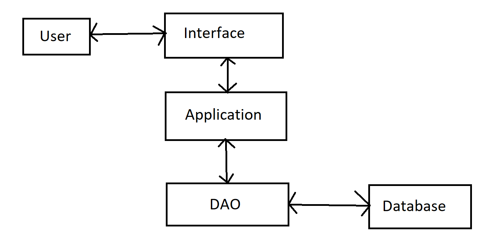
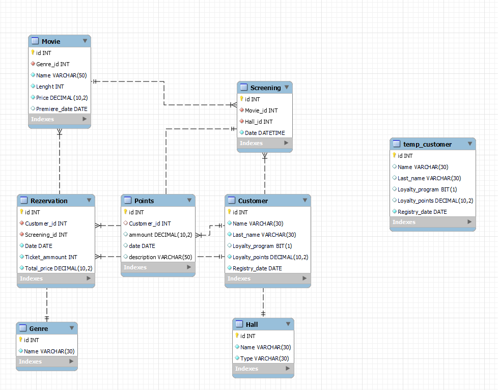

# Cinema Database Project

## Project Information

- **Project Name**: Cinema city database
- **Author**: Adam Hlaváčik
- **Contact Information**: hlavacik@spsejecna.cz
- **Date of Completion**: 17.01.2025
- **Institution:** Střední průmyslová škola elektrotechnická, Praha 2, Ječná 30 
- **Type of project:** School project

---

## Project Description
This project is a Cinema Database Manager, built using MySQL for the database and Python for application logic. It allows for the management of genres, movies, halls, screenings, customers, reservations, and loyalty points.

---

## Features and Components


### Architecture
- User
  - This is the client that acceses this app.
- Interface
  - This is the part of the application that mannges inputs and messages.
- Application
  - This is the part of the application that connects the interface with DAO
- DAO
  - This is the part that connects to Database and executes CRUD operations.
- Database
  - This is the databse where the data is stored

---

## Database Design

### E-R Model


### Import/Export Schema
- The application enables importing data from json.

---

## Configuration

### Application Configuration
- Configuration file: `appconfig.json`.
- Database
  - `host`: ip address of the DB server
  - `port`: port address of the DB server
  - `user`: username for your connection to your DB server
  - `password`: password for your connection to your DB server
  - `database`: Name of your database
- Example of `appconfig.json`:
```json
{
    "database":{
        "host":"ip",
        "port":port,
        "user":"username",
        "password":"password",
        "database":"DatabaseName"
    }
}
```

### Transaction Isolation Levels
- Users can set isolation levels to:
  - `READ UNCOMMITTED`
  - `READ COMMITTED`
  - `REPEATABLE READ`
  - `SERIALIZABLE`
- only with `READ UNCOMMITTED` is `Dirty Reads` possible.

- Example of `config.json`:
```json
{
    "izolation_level": "READ UNCOMMITTED"
}
```

---

## Installation and Setup
In IDE enviroment
1. Clone the repository.
2. Configure the database connection in `appconfig.json`.
3. Configure the isolation level `config.json`.
4. Run the `Cinema.sql` setup scripts to create the database.
5. Execute the application using:
   ```bash
   python main.py
   ```

---  
## Sources and consulted
- ChatGPT
- Wikipedia
- W3Schools
- GeeksforGeeks
- Python Docs
- Martin Hornych
- Tomáš Križko
- Ondra Kábrt


## Usage

### Core Features
- **Manage Movies and Genres**: Add, update, delete movie and genre records.
- **Screenings**: Schedule and manage screenings.
- **Reservations**: Create and manage reservations for screenings.
- **Loyalty Points**: Transfer points and view transaction history.
- **Reports**:
  - Total movie ticket sales.
  - Customer reservations for upcoming screenings.
  - All reservations summary.
  - Movie performance summary.
  - Revenue by hall type and genre.

---

## Error Handling
- **Errors**: Managed using custom exceptions (all can be found in `Error.py`).
- **Database errors**: Managed with try except and on succes or failier is commit/rollback executed.
- **Validation**: All validation checks for the attributes are in `Input_check.py`

---

## Dependencies
- Python libraries:
  - `mysql-connector-python`
  - `pyinstaller`
- MySQL database.
- How to install dependencies:
   ```bash
   python.exe -m venv venv
   ./venv/Script/pip.exe -r requirements.txt
   ```

---

## Summary
This Cinema Database Management System provides optimal solution for managing cinema operations. It ensures data integrity, supports advanced features like loyalty programs, and adheres to high standards of configurability and error handling.